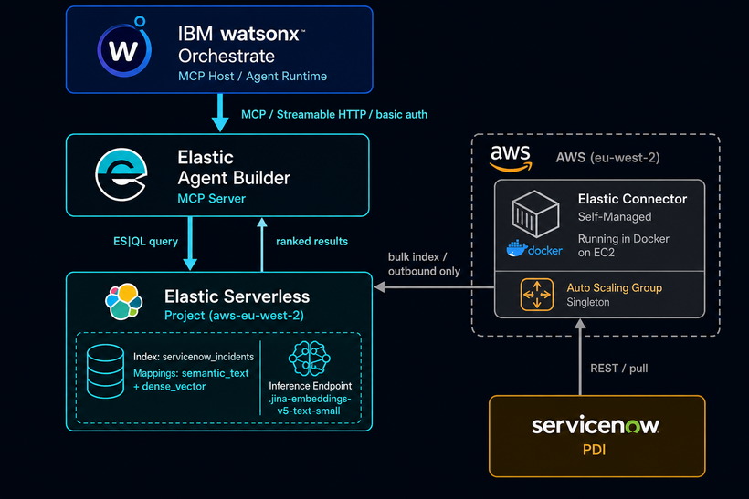
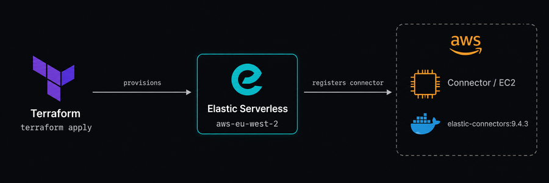
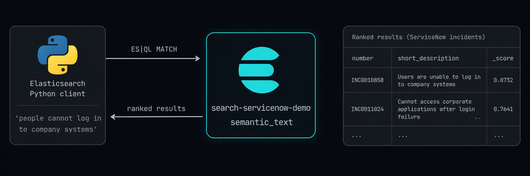
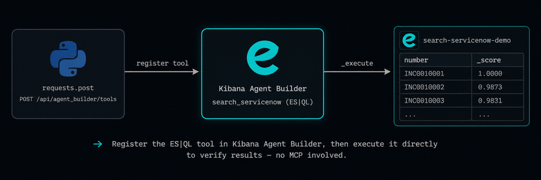
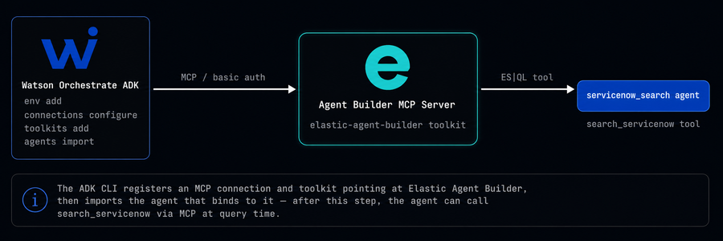
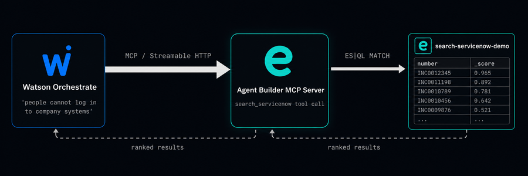

# Agentic ServiceNow Search: IBM Orchestrate via MCP + Elastic
*See how IBM Watson Orchestrate and Elastic use MCP to answer natural-language ServiceNow queries — no keywords, no custom code.*

In this article, I demonstrate the integration of [ServiceNow](https://www.servicenow.com/) with Elastic via the [Elastic ServiceNow connector](https://www.elastic.co/docs/reference/search-connectors/es-connectors-servicenow). I create an ES|QL MCP tool in Elastic Agent Builder that is then used to perform a query from an [IBM watsonx Orchestrate](https://www.ibm.com/products/watsonx-orchestrate) agent.

I perform all infrastructure provisioning via Terraform: [Elastic Serverless](https://www.elastic.co/docs/deploy-manage/deploy/elastic-cloud/serverless) and an AWS VM for the Elastic Connector. I configure the Orchestrate agent environment via the ADK CLI. All the above is executed step by step in a Jupyter notebook.

---

## What This Article Covers

- Elastic Serverless deployment via Terraform
- Elastic ServiceNow connector deployment on an [AWS Auto Scaling group](https://docs.aws.amazon.com/autoscaling/ec2/userguide/auto-scaling-groups.html) (ASG) to provide fault tolerance
- Execution of an [ES|QL](https://www.elastic.co/docs/reference/query-languages/esql) query against the ServiceNow PDI data from the Elastic Python client
- Execution of that same query from an IBM Orchestrate agent via [MCP tools](https://www.elastic.co/docs/explore-analyze/ai-features/agent-builder/tools/mcp-tools) on Elastic.

---

## Business Value
- Faster incident resolution — agents find the right ServiceNow record from a plain-English description, no ticket number or exact keyword needed
- Zero integration code — MCP connects Orchestrate to Elastic's search tool out of the box; no custom API glue, no middleware
- Semantic understanding over keyword matching — queries that share no words with the indexed text still return the correct results

---

## Architecture


---

## Provisioning


I use Terraform for all provisioning and a Jupyter notebook for orchestration. Terraform configuration is organised into the following modules:

### Module 1 — `elastic_serverless`
Creates an **Elastic Serverless Elasticsearch project** (`general_purpose`) in region `aws-eu-west-2`. Outputs the Elasticsearch endpoint, Kibana URL, cloud ID, and auto-generated admin credentials.

### Module 2 — `aws_network`
Resolves the account's **default VPC and subnets** via data sources (no VPC is created). Creates a **security group** with a single egress rule: outbound HTTPS (port 443) only. No inbound rules — all connector traffic is outbound.

### Module 3 — `connector_agent`
Provisions the **EC2 host** that runs the Elastic connector service:

- **AMI**: latest Amazon Linux 2023 (x86_64), resolved at plan time
- **Instance type**: `t3.small`
- **Storage**: encrypted gp3 EBS root volume (org policy requirement)
- **Networking**: public IP, egress-only security group from Module 2
- **User data**: `templatefile()` renders a startup script that pulls and runs the connector Docker image (`docker.elastic.co/integrations/elastic-connectors:9.4.3`), injecting the Elasticsearch endpoint and connector API key at apply time — no Secrets Manager, no IAM roles
- **Auto Scaling Group**: singleton (min=1, max=1, desired=1) spanning all default subnets, providing self-healing if the instance is terminated. Org-required tags are set explicitly on the ASG (ASGs do not inherit provider `default_tags`)

### Module 4 — `servicenow_connector`
Registers and configures the **ServiceNow connector** in Elasticsearch:

- **Index** (`search-servicenow-demo`): created first with explicit `semantic_text` mappings on `short_description`, `description`, and `text`, all backed by the `.jina-embeddings-v5-text-small` inference endpoint
- **Connector registration**: a `curl PUT /_connector/{id}` call that creates the connector document, linking it to the index and setting `service_type: servicenow`
- **Connector configuration**: pushes ServiceNow URL, credentials, and the four service types to sync — `Incident`, `Knowledge`, `Change Request`, `Requested Item`. The connector service registers its configuration schema on first check-in from EC2; this step retries up to 40 × 15 s (10 min) waiting for that handshake before pushing values
- **Scoped API key**: a least-privilege key scoped to `monitor` + `manage_connector` cluster privileges and `all` on the index and `.elastic-connectors*` system indices — this key is baked into the EC2 user data at apply time

---

## Semantic Query: Direct to Elasticsearch


- Runs a semantic query directly against the Elasticsearch index
- Uses the `semantic` query type against the `semantic_text` fields backed by `.jina-embeddings-v5-text-small`

```python
IDX   = os.environ['INDEX_NAME']
QUERY = 'people cannot log in to company systems'

ESQL = f"""
FROM {IDX} METADATA _score
| WHERE (MATCH(short_description, ?query) OR MATCH(description, ?query))
  AND sys_class_name == "incident"
| KEEP number, sys_class_name, short_description, state, _score
| SORT _score DESC
| LIMIT 5
"""

resp = es.esql.query(query=' '.join(ESQL.split()), params=[{'query': QUERY}])
```

**Results**
| number | sys_class_name | short_description | state | _score |
| --- | --- | --- | --- | --- |
| INC0009003 | incident | Cannot sign into the company portal app | 7 | 1.6119 |
| INC0000046 | incident | Can't access SFA software | 1 | 1.5302 |
| INC0010014 | incident | Account lockout after directory sync discrepancy | 1 | 1.5265 |
| INC0010015 | incident | Account lockout after directory sync discrepancy | 1 | 1.5265 |
| INC0000044 | incident | Can't log into SAP from my laptop today | 2 | 1.5148 |

---

## Create & Verify ES|QL Search Tool


- Registers `search_servicenow` as an **ES|QL tool** in Kibana Agent Builder via the REST API
  - Uses the same natural-language query as above.
- Executes the tool directly against Kibana (no MCP, no OAuth) to confirm hits and latency

```python
resp = requests.post(f'{KIBANA}{ENDPOINT}', auth=AUTH, headers=HDRS, json=tool)
```

**Results**
| number | sys_class_name | short_description | state | _score |
| --- | --- | --- | --- | --- |
| INC0009003 | incident | Cannot sign into the company portal app | 7 | 1.6119 |
| INC0000046 | incident | Can't access SFA software | 1 | 1.5302 |
| INC0010014 | incident | Account lockout after directory sync discrepancy | 1 | 1.5265 |
| INC0010015 | incident | Account lockout after directory sync discrepancy | 1 | 1.5265 |
| INC0000044 | incident | Can't log into SAP from my laptop today | 2 | 1.5148 |

---

## Wire Orchestrate


- Activates the `orchestrate-relay` Agent Development Kit (ADK) environment (Orchestrate Standard API URL + key)
- Registers an MCP **connection** (`elastic_mcp`) using basic auth (Elastic username/password against the MCP server URL)
- Registers the `elastic-agent-builder` MCP **toolkit** — `streamable_http` transport, all tools (`-t '*'`), backed by the connection above
- Imports `orchestrate/agent.yaml` as the `servicenow_search` agent:
  - Style `experimental_customer_care` — required for MCP toolkit support in the ADK
  - Instructions force tool use; the toolkit binding exposes `search_servicenow` at runtime

**Agent.yaml**
```yaml
spec_version: v1
kind: native
name: servicenow_search
description: >
  Searches indexed ServiceNow data (incidents, knowledge articles, change requests,
  requested items) using semantic search via the Elastic Agent Builder MCP server.
instructions: >
  You are an IT support assistant. Always use the search_servicenow tool to answer
  questions about IT incidents, knowledge articles, change requests, or service
  requests. Never answer from your own knowledge. Summarise the returned records as
  a table showing number, short_description, and state.
style: experimental_customer_care
llm: groq/openai/gpt-oss-120b
toolkits:
  - elastic-agent-builder
```

**Orchestrate Provisioning**
```python
echo "--- Activating Orchestrate environment ---"
echo Y | orchestrate env add --name orchestrate-relay --url "$ORCHESTRATE_URL"
orchestrate env activate orchestrate-relay --api-key "$ORCHESTRATE_API_KEY"

echo "--- Registering MCP connection (API key) ---"
orchestrate connections add -a elastic_mcp >/dev/null 2>&1 || true
orchestrate connections configure -a elastic_mcp \
  --env draft -t team -k basic -u "$MCP_SERVER_URL"
orchestrate connections set-credentials -a elastic_mcp --env draft \
  --username "$ELASTIC_USERNAME" \
  --password "$ELASTIC_PASSWORD"

echo "--- Registering MCP toolkit (idempotent) ---"
orchestrate toolkits remove -n elastic-agent-builder >/dev/null 2>&1 || true
orchestrate toolkits add -k mcp \
  -n elastic-agent-builder \
  --description 'ServiceNow semantic search via Elastic Agent Builder' \
  -u "$MCP_SERVER_URL" --transport streamable_http \
  -t '*' -a elastic_mcp

echo "--- Importing agent ---"
orchestrate agents import -f orchestrate/agent.yaml
```

---

## Ask via Orchestrate


- Sends the same natural-language query used previously to the `servicenow_search` agent via `orchestrate chat ask`
- End-to-end path: Orchestrate → MCP (Streamable HTTP) → Elastic Agent Builder → ES|QL → ServiceNow index
- `--include-reasoning` prints the **🧠 Reasoning Trace** showing the MCP tool call and its response

```python
QUERY='people cannot log in to company systems'
echo "Query: $QUERY"
echo ''

# pipe "exit" so the interactive loop exits cleanly after printing the response
echo "exit" | orchestrate chat ask \
  --agent-name "$ORCHESTRATE_AGENT_NAME" \
  --include-reasoning \
  "$QUERY"
```

**Results**
```text
╭─ 🧠 Reasoning Trace ─────────────────────────────────────────────────────────╮
│                                                                              │
│  Step 1: Called tool 'elastic-agent-builder__search_servicenow'              │
│    Agent:                                                                    │
│  Step 2: Tool 'elastic-agent-builder__search_servicenow' responded           │
│    Response: {"results":[{"type":"query","data":{"esql":"FROM                │
│  search-servicenow-demo METADATA _score\n| WHERE\n                           │
│  (MATCH(short_description, \"people cannot log in to company systems\")\n    │
│  OR MATCH(description, \"people cannot log in to company systems\"))\n       │
│  AND sys_class_name == \"incident\"\n| KEEP number, sys_class_name,          │
│  short_description, state, _score\n| SORT _score DESC\n| LIMIT               │
│  5"},"tool_result_id":"2b9fcw"},{"tool_result_id":"h7IoM7","type":"esql_res  │
│  ults","data":{"source":"esql","query":"FROM search-servicenow-demo          │
│  METADATA _score\n| WHERE\n    (MATCH(short_description, \"people cannot     │
│  log in to company systems\")\n      OR MATCH(description, \"people cannot   │
│  log in to company systems\"))\n      AND sys_class_name == \"incident\"\n|  │
│  KEEP number, sys_class_name, short_description, state, _score\n| SORT       │
│  _score DESC\n| LIMIT                                                        │
│  5","columns":[{"name":"number","type":"text"},{"name":"sys_class_name","ty  │
│  pe":"text"},{"name":"short_description","type":"text"},{"name":"state","ty  │
│  pe":"text"},{"name":"_score","type":"double"}],"values":[["INC0009003","in  │
│  cident","Cannot sign into the company portal                                │
│  app","7",1.6118814945220947],["INC0000046","incident","Can't access SFA     │
│  software","1",1.530163288116455],["INC0010015","incident","Account lockout  │
│  after directory sync                                                        │
│  discrepancy","1",1.5264983177185059],["INC0010014","incident","Account      │
│  lockout after directory sync                                                │
│  discrepancy","1",1.5264983177185059],["INC0000044","incident","Can't log    │
│  into SAP from my laptop today","2",1.5147528648376465]]}}]}                 │
│                                                                              │
╰──────────────────────────────────────────────────────────────────────────────╯
╭─ 🤖 servicenow_search ───────────────────────────────────────────────────────╮
│                                                                              │
│  ServiceNow Incidents matching “people cannot log in to company systems”     │
│                                                                              │
│                                                                              │
│    #   short_description                                  state              │
│   ━━━━━━━━━━━━━━━━━━━━━━━━━━━━━━━━━━━━━━━━━━━━━━━━━━━━━━━━━━━━━━             │
│    1   Cannot sign into the company portal app            7                  │
│    2   Can't access SFA software                          1                  │
│    3   Account lockout after directory sync discrepancy   1                  │
│    4   Account lockout after directory sync discrepancy   1                  │
│    5   Can't log into SAP from my laptop today            2                  │
│                                                                              │
│                                                                              │
╰──────────────────────────────────────────────────────────────────────────────╯
```

---

## Summary

- Elastic connects to ServiceNow out of the box via the self-managed connector — no custom ETL required.
- MCP-based tools in Elastic Agent Builder enforce deterministic tool use from agents.
- IBM Orchestrate connects to Elastic via MCP — enabling natural-language ServiceNow search with no custom API integration.

---

## Source

Full source code on [GitHub](https://github.com/joeywhelan/orchestrate-relay).

---